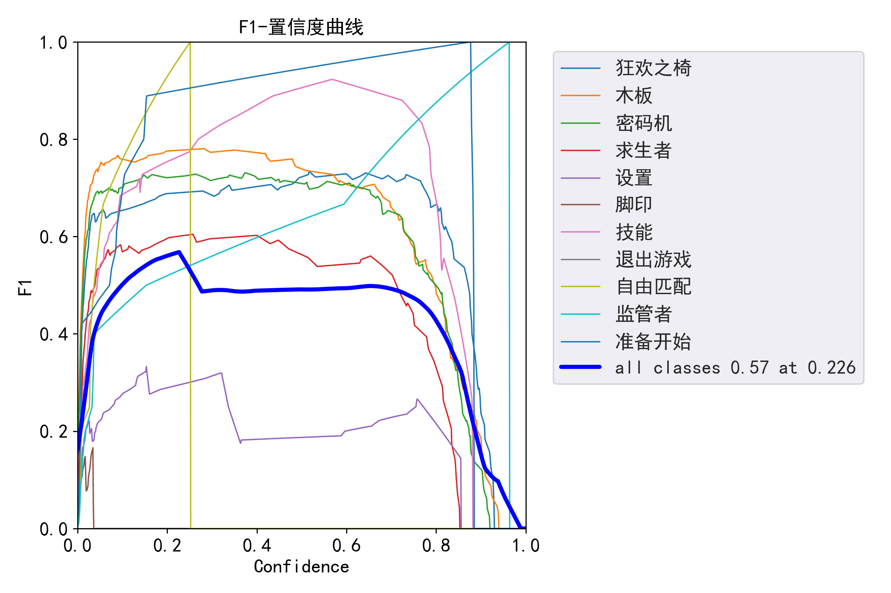
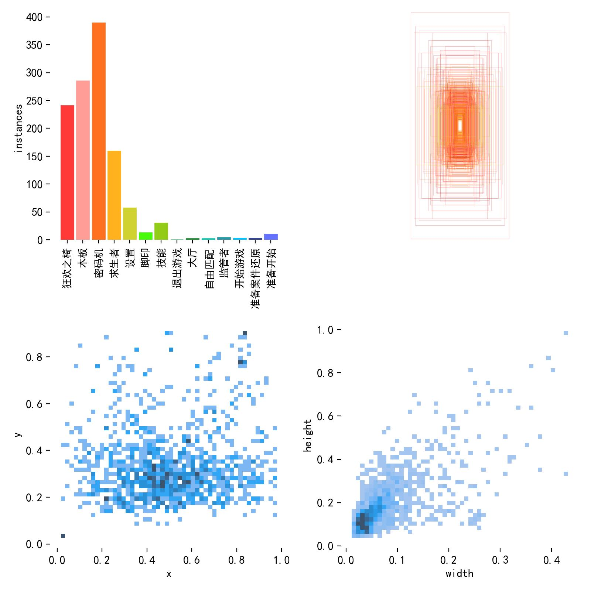
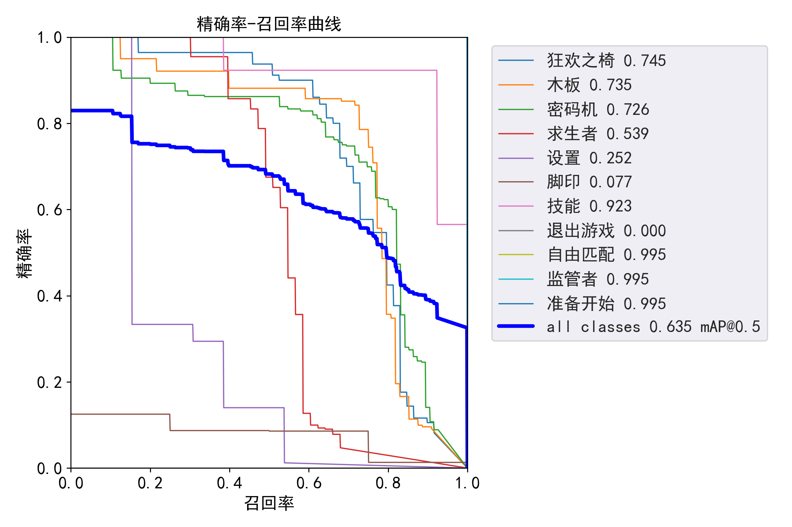
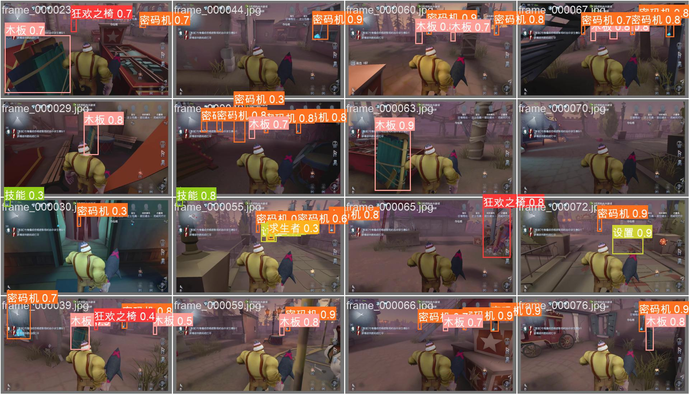
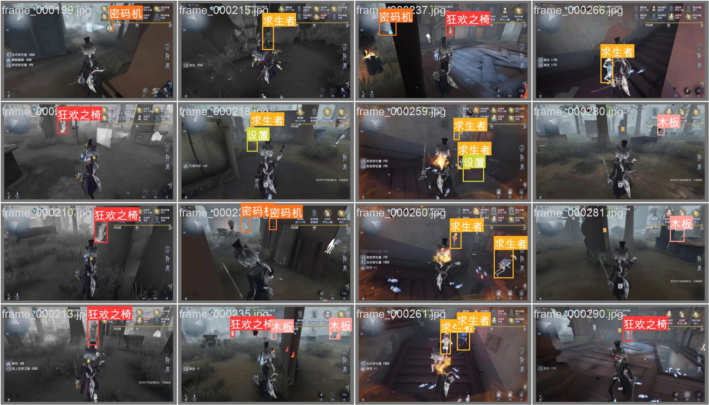
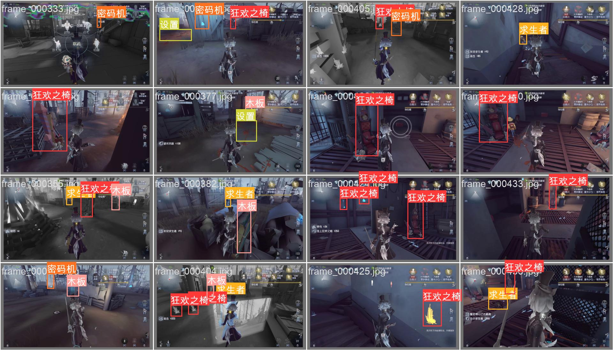

# 📌 效果展示
## 准确率



## 效果




# 📌 YOLOv5 目标检测完整流程

---

## **第一步 🎥 OBS 录制视频**
使用 OBS 进行屏幕录制，生成视频数据。

---

## **第二步 ✂️ Python 脚本切片**
使用 `ffmpeg` 进行视频切片：
```bash
ffmpeg -i input.mp4 -ss 00:00:00 -t 00:00:10 output.mp4
```

---

## **第三步 🏷️ LabelImg 框选**
安装 `labelImg` 并进行标注：
```bash
pip install labelImg
labelImg
```

---

## **第四步 🏗️ 划分训练集和验证集**
可以手动划分，也可以使用 `split.py` 脚本自动划分：
这里使用python脚本进行划分：
运行 `split.py`：


## **第五步 ⚙️ 配置 YOLOv5**
克隆 YOLOv5 仓库并安装依赖：
```bash
git clone https://github.com/ultralytics/yolov5.git
cd yolov5
pip install -r requirements.txt
```
创建 `dataset.yaml`：
```yaml
train: ./train/images
val: ./val/images
nc: 6
names: ['class1', 'class2', 'class3', 'class4', 'class5', 'class6']
```

---

## **🔥 开始训练**
这里使用的是50轮训练，可以根据需要调整训练轮数。
cd到 `yolov5` 目录，运行训练命令：
运行训练命令：
```bash
python train.py --img 640 --batch 16 --epochs 50 --data data.yaml --weights yolov5s.pt
```
📌 **参数说明**：
- `--img 640`：输入图片大小
- `--batch 16`：批量大小
- `--epochs 50`：训练轮数
- `--data dataset.yaml`：数据集配置文件
- `--weights yolov5s.pt`：预训练模型权重
参数可以自动调整，根据需要调整训练轮数。

---

## **📊 训练结果**
训练完成后，结果存放在 `runs/train/exp` 目录：
```plaintext
weights/               # 最终模型权重
├── last.pt            # 训练最后一次的模型
├── best.pt            # 训练效果最好的模型
results.png            # 训练曲线可视化
labels_correlogram.jpg # 训练集中类别分布热力图
F1_curve.png           # F1 指标曲线
PR_curve.png           # 精确率-召回率曲线
```

---

## **🚀 第六步 测试**
使用最佳模型测试：
```bash
python detect.py --weights runs/train/exp/weights/best.pt --source "D:/text.mkv" --device cpu
```

📌 **参数说明**：
- `--weights`：指定训练好的模型 (`best.pt`)
- `--source`：输入文件路径（可以是图片/视频）
- `--device`：选择运行设备（`cpu` 或 `cuda`）
- `--conf-thres 0.3`：置信度阈值
- `--iou-thres 0.5`：IoU 阈值

---

## **📌 运行结果**
检测结果会保存在 `runs/detect/exp/` 目录下。

**🎯 你可以在 `runs/detect/exp/` 中查看带有目标检测框的输出视频！**


---

## **🎉 完结！**
希望这个流程能帮助你成功训练自己的 YOLOv5 模型！

> 遇到的问题

>📌 1. 首先在第一次对图片进行训练的时候，一直报错，后面发现目标图片路径不能包含中文                  
>📌 2. 其次，模型构建完成后发现生成的精确度和召回率图片中中文均乱码，显示方框。这里选择使用SimHei.ttf字体；并且重构了绘制图像的目标函数，使其可以正常显示中文。
```plaintext
yolov5
├── detect.py # 修改了部分函数，使其可以正常显示中文
├── utils
│   ├── metrics.py  # 负责绘制精确度和召回率曲线
│   ├── metrics_py.bak  # 备份文件
│   ├── custom_annotator.py # 新创建的视屏处理程序，这里采用了了另一种方法
```


>📌 3. 再者，测试的时候发现，处理的目标视屏中，中文标签显示繁体乱码，这里选择使用SimHei.ttf字体，并且重构了绘制标签部分的个别目标函数，使其可以正常显示中文。

> 上述最好的模型：runs/train/exp3/weights/best.pt
